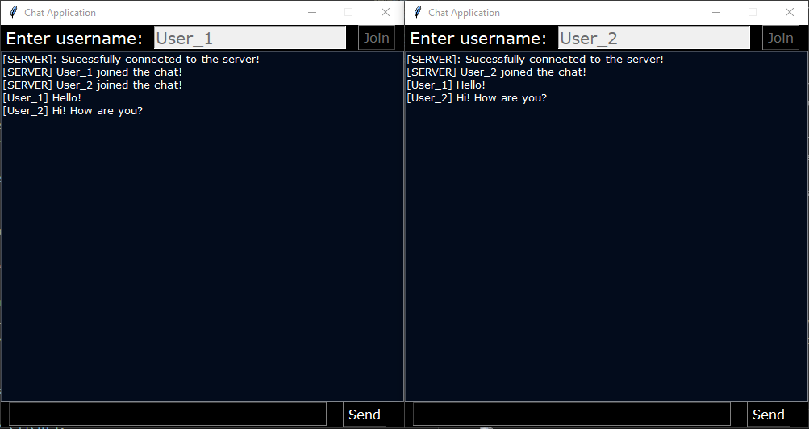

# ChatApp

Chat application made with python sockets and using Tkinter as the Graphical User Interface (GUI).

# Purpose of the application

- Learn of sockets and network communication works on python.
- Learn basic network protocols and how to create a server to host the communication between clients connected to a same IP address.
- Being able to implement a way for the server to wait for connection requests and handling several clients at once to decode the destination user and select the desired socket of communication between the parties.
- Learn how to write a new GUI with the Tkinter Python interface to provide a great and intuitive way for users to interact with the application.

# How to run the application

- Clone this repository
- Open a terminal inside the project folder
- Run the client.py file: `python3 server.py` or `python server.py` on Windows
- Run as many clients as desired: `python3 client.py` or `python client.py` on Windows (This applications supports a maximum of 5 clients at once).

# Screenshots

